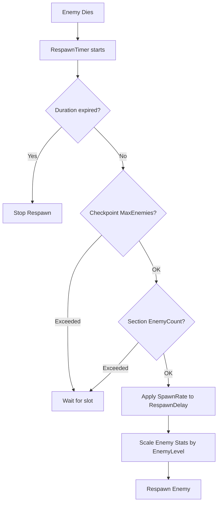

# Enemy Resp

awn Limitation System

## Mục tiêu

Implement limitation system để tránh respawn liên tục không điểm dừng, sử dụng các field từ `GameSection` và `Checkpoint` đã có.

## Phân tích hiện trạng

### Server Side

- **`EnemyState`** hiện tại có: `SpawnX`, `SpawnY` (vị trí checkpoint), KHÔNG có `CheckpointId` hoặc `SectionId`
- **`SessionState`** có `Enemies` dictionary - có thể count enemies per checkpoint/section
- **`ProcessEnemyRespawns()`** respawn không có limitation - respawn mãi mãi
- **`Checkpoint.MaxEnemies`** chỉ dùng khi spawn ban đầu, không check khi respawn

### Unity Client Side

- **Unity KHÔNG cần SectionID** - chỉ nhận `EnemySnapshot` từ server
- **`EnemySnapshot`** có: `id`, `typeId`, `x`, `y`, `hp`, `maxHp`, `status`
- Client chỉ cần render enemies, không handle limitation logic

## Solution Architecture




## Implementation Plan

### 1. Update `EnemyState` Model (`server/Models/States/EnemyState.cs`)

**Thêm fields để track checkpoint/section:**

```csharp
public class EnemyState
{
    // ... existing fields ...
    
    // Tracking fields (for limitation checks)
    public int? CheckpointId { get; set; } // ID của checkpoint spawn enemy này
    public int? SectionId { get; set; } // ID của section chứa checkpoint
    
    // Level scaling
    public int EnemyLevel { get; set; } = 1; // Level của enemy (scaled from GameSection.EnemyLevel)
    
    // Respawn control
    public float BaseRespawnDelay { get; set; } = 5f; // Base delay từ enemy config
    public float RespawnDelay { get; set; } = 5f; // Actual delay (modified by SpawnRate)
}
```


### 2. Update `WorldService.InitializeRoomCheckpointsAsync()` (`server/Services/WorldService.cs`)

**Khi spawn enemy ban đầu, lưu `CheckpointId` và `SectionId`:**

- Load `GameSection` khi initialize room
- Store `sectionId` trong `SessionState` (cần thêm field `CurrentSectionId`)
- Khi spawn enemy từ checkpoint, set `CheckpointId` và `SectionId` vào `EnemyState`
- Apply `GameSection.EnemyLevel` vào `EnemyState.EnemyLevel`
- Apply `GameSection.SpawnRate` vào `RespawnDelay` calculation

**Logic spawn:**

```csharp
foreach (var checkpoint in checkpoints)
{
    // ... existing logic ...
    
    for (int i = 0; i < checkpoint.MaxEnemies; i++)
    {
        var enemyState = CreateEnemyState(typeId, checkpoint.X, checkpoint.Y, config);
        
        // Set tracking fields
        enemyState.CheckpointId = checkpoint.CheckpointId;
        enemyState.SectionId = sectionToUse; // GameSection ID
        enemyState.EnemyLevel = section?.EnemyLevel ?? 1;
        
        // Calculate RespawnDelay with SpawnRate
        float baseDelay = config.RespawnDelay; // From enemy config
        float spawnRate = section?.SpawnRate ?? 1.0f;
        enemyState.BaseRespawnDelay = baseDelay;
        enemyState.RespawnDelay = baseDelay / spawnRate; // SpawnRate > 1 = faster respawn
        
        // Scale stats by level
        ScaleEnemyStatsByLevel(enemyState, config, enemyState.EnemyLevel);
        
        sessionState.Enemies[enemyState.Id] = enemyState;
    }
}
```


### 3. Update `SessionState` (`server/Models/States/SessionState.cs`)

**Thêm fields để track section và timing:**

```csharp
public class SessionState
{
    // ... existing fields ...
    
    public int? CurrentSectionId { get; set; } // Current active GameSection
    public DateTime? SectionStartTime { get; set; } // When section started
    public int? SectionDuration { get; set; } // Duration in seconds (null = unlimited)
}
```


### 4. Create Helper Methods trong `WorldService`

**`ScaleEnemyStatsByLevel()`:**

```csharp
private void ScaleEnemyStatsByLevel(EnemyState enemy, EnemyConfig baseConfig, int level)
{
    if (level <= 1) return; // No scaling for level 1
    
    float multiplier = 1f + (level - 1) * 0.1f; // +10% per level above 1
    
    enemy.MaxHp = (int)(baseConfig.MaxHealth * multiplier);
    enemy.Hp = enemy.MaxHp; // Full HP on spawn
    enemy.Damage = (int)(baseConfig.Damage * multiplier);
    // Speed, ranges don't scale (keep base values)
}
```

**`CountAliveEnemiesAtCheckpoint()`:**

```csharp
private int CountAliveEnemiesAtCheckpoint(SessionState session, int checkpointId)
{
    return session.Enemies.Values
        .Count(e => e.CheckpointId == checkpointId && e.Hp > 0 && e.Status != EnemyStatus.Dead);
}
```

**`CountAliveEnemiesInSection()`:**

```csharp
private int CountAliveEnemiesInSection(SessionState session, int sectionId)
{
    return session.Enemies.Values
        .Count(e => e.SectionId == sectionId && e.Hp > 0 && e.Status != EnemyStatus.Dead);
}
```

**`IsSectionDurationExpired()`:**

```csharp
private bool IsSectionDurationExpired(SessionState session)
{
    if (!session.SectionDuration.HasValue || !session.SectionStartTime.HasValue)
        return false; // Unlimited duration
    
    var elapsed = (DateTime.UtcNow - session.SectionStartTime.Value).TotalSeconds;
    return elapsed >= session.SectionDuration.Value;
}
```


### 5. Update `ProcessEnemyRespawns()` (`server/Services/WorldService.cs`)

**Implement limitation logic:**

```csharp
private void ProcessEnemyRespawns(SessionState session)
{
    lock (_sessionLock)
    {
        // Check if section duration expired (stop all respawns)
        if (IsSectionDurationExpired(session))
        {
            _logger.LogDebug("Section duration expired, no more respawns");
            return;
        }
        
        // Load GameSection for limitation checks (cached or from DB)
        GameSection? section = null;
        if (session.CurrentSectionId.HasValue)
        {
            section = await LoadGameSectionAsync(session.CurrentSectionId.Value);
        }
        
        foreach (var enemy in session.Enemies.Values.ToList())
        {
            if (enemy.Status != EnemyStatus.Dead || enemy.Hp > 0)
                continue;
            
            // Check checkpoint-level limitation
            if (enemy.CheckpointId.HasValue)
            {
                using var scope = _serviceProvider.CreateScope();
                var checkpointService = scope.ServiceProvider.GetRequiredService<CheckpointService>();
                var checkpoint = await checkpointService.GetCheckpointAsync(enemy.CheckpointId.Value);
                
                if (checkpoint != null)
                {
                    int aliveAtCheckpoint = CountAliveEnemiesAtCheckpoint(session, checkpoint.CheckpointId);
                    if (aliveAtCheckpoint >= checkpoint.MaxEnemies)
                    {
                        // Checkpoint at max capacity, skip respawn
                        _logger.LogDebug("Checkpoint {CheckpointId} at max capacity ({Max}/{Max}), skipping respawn",
                            checkpoint.CheckpointId, aliveAtCheckpoint, checkpoint.MaxEnemies);
                        continue;
                    }
                }
            }
            
            // Check section-level limitation
            if (section != null && enemy.SectionId == section.SectionId)
            {
                int aliveInSection = CountAliveEnemiesInSection(session, section.SectionId);
                if (aliveInSection >= section.EnemyCount)
                {
                    // Section at max capacity, skip respawn
                    _logger.LogDebug("Section {SectionId} at max capacity ({Alive}/{Max}), skipping respawn",
                        section.SectionId, aliveInSection, section.EnemyCount);
                    continue;
                }
            }
            
            // Increment respawn timer
            enemy.RespawnTimer += TickDeltaTime;
            
            // Check if respawn delay has been reached (already adjusted by SpawnRate)
            if (enemy.RespawnTimer >= enemy.RespawnDelay)
            {
                // Respawn enemy
                enemy.Hp = enemy.MaxHp; // HP already scaled by level
                enemy.X = enemy.SpawnX;
                enemy.Y = enemy.SpawnY;
                enemy.Status = EnemyStatus.Idle;
                enemy.RespawnTimer = 0f;
                
                _logger.LogInformation("Respawned enemy {EnemyId} ({TypeId}) Lv{Level} at checkpoint {CheckpointId} after {Delay}s",
                    enemy.Id, enemy.TypeId, enemy.EnemyLevel, enemy.CheckpointId, enemy.RespawnDelay);
            }
        }
    }
}
```


### 6. Update `InitializeRoomCheckpointsAsync()` (`server/Services/WorldService.cs`)

**Store section info in SessionState:**

```csharp
private async Task InitializeRoomCheckpointsAsync(string sessionId, int? sectionId = null)
{
    // ... existing logic to load section ...
    
    if (sectionToUse.HasValue)
    {
        var section = await db.GameSections.FindAsync(sectionToUse.Value);
        
        // Store section info in session
        sessionState.CurrentSectionId = sectionToUse.Value;
        sessionState.SectionStartTime = DateTime.UtcNow;
        sessionState.SectionDuration = section?.Duration; // null = unlimited
        
        // ... spawn enemies with CheckpointId, SectionId, EnemyLevel ...
    }
}
```


### 7. Create `LoadGameSectionAsync()` Helper (`server/Services/WorldService.cs`)

**Cache section data:**

```csharp
private readonly ConcurrentDictionary<int, GameSection> _sectionCache = new();

private async Task<GameSection?> LoadGameSectionAsync(int sectionId)
{
    if (_sectionCache.TryGetValue(sectionId, out var cached))
        return cached;
    
    using var scope = _serviceProvider.CreateScope();
    var db = scope.ServiceProvider.GetRequiredService<GameDbContext>();
    var section = await db.GameSections.FindAsync(sectionId);
    
    if (section != null)
        _sectionCache[sectionId] = section;
    
    return section;
}
```


### 8. Update `CheckpointService` (nếu cần) (`server/Services/CheckpointService.cs`)

**Thêm method `GetCheckpointAsync()`:**

```csharp
public async Task<Checkpoint?> GetCheckpointAsync(int checkpointId)
{
    // Check cache first
    if (_checkpointCache.TryGetValue(checkpointId.ToString(), out var cached))
        return cached;
    
    // Load from DB
    using var scope = _serviceProvider.CreateScope();
    var db = scope.ServiceProvider.GetRequiredService<GameDbContext>();
    var checkpoint = await db.Checkpoints
        .Include(c => c.Section)
        .FirstOrDefaultAsync(c => c.CheckpointId == checkpointId);
    
    if (checkpoint != null)
        _checkpointCache[checkpointId.ToString()] = checkpoint;
    
    return checkpoint;
}
```


## Unity Client Side (KHÔNG CẦN THAY ĐỔI)

**Unity client không cần biết SectionID vì:**

- Server handle tất cả limitation logic
- Client chỉ nhận `EnemySnapshot` (enemies đã được filtered/respawned bởi server)
- Client chỉ cần render enemies, không cần biết logic respawn

**`EnemySnapshot` structure không đổi:**

```csharp
public class EnemySnapshot
{
    public string id;
    public string typeId;
    public float x;
    public float y;
    public int hp;
    public int maxHp; // Already scaled by EnemyLevel on server
    public string status;
}
```


## Testing Checklist

- [ ] Checkpoint limitation: Không respawn nếu checkpoint đã đạt `MaxEnemies`
- [ ] Section limitation: Không respawn nếu section đã đạt `EnemyCount`
- [ ] SpawnRate: RespawnDelay được adjust đúng (baseDelay / spawnRate)
- [ ] Duration: Respawn dừng sau `Duration` giây
- [ ] EnemyLevel: Stats được scale đúng (HP, Damage +10% per level)