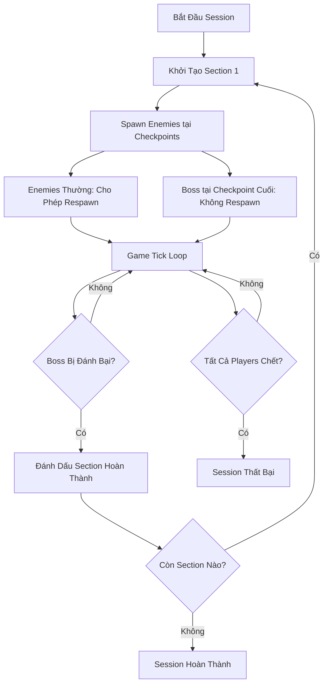

# Kế H

oạch Triển Khai Hệ Thống Campaign Đa Section

## Tổng Quan

Kế hoạch này triển khai hệ thống campaign trong đó session tiến triển qua nhiều GameSections. Mỗi section chứa các checkpoints với enemies thường (cho phép respawn) và một boss tại checkpoint cuối (không respawn). Đánh bại boss sẽ chuyển sang section tiếp theo. Hoàn thành tất cả sections sẽ kết thúc session.

## Luồng Kiến Trúc

## Các Giai Đoạn Triển Khai

### Giai Đoạn 1: Cập Nhật Data Models

**Các file cần chỉnh sửa:**

- `server/Models/States/SessionState.cs`
- `server/Models/States/EnemyState.cs`

**Các thay đổi:**

1. **SessionState** - Thêm các trường theo dõi tiến triển section:

- Enum `SessionStatus`: `InProgress`, `Completed`, `Failed`
- `CurrentSectionId` (int?): Section đang active
- `SectionStartTime` (DateTime?): Thời điểm section hiện tại bắt đầu
- `CompletedSections` (List<int>): Danh sách các section đã hoàn thành
- `Status` (SessionStatus): Trạng thái session
- `CurrentBossId` (Guid?): ID của boss enemy đang active
- `IsBossAlive` (bool): Cờ trạng thái boss còn sống

2. **EnemyState** - Thêm các trường theo dõi:

- `CheckpointId` (int?): Checkpoint nơi enemy được spawn
- `SectionId` (int?): Section chứa checkpoint
- `EnemyLevel` (int): Level để scale (từ GameSection.EnemyLevel)
- `IsBoss` (bool): Định danh boss
- `BaseRespawnDelay` (float): Delay cơ bản trước khi điều chỉnh SpawnRate

### Giai Đoạn 2: Logic Khởi Tạo Section

**File cần chỉnh sửa:**

- `server/Services/WorldService.cs`

**Các Method Mới/Cập Nhật:**

1. **Cập nhật `InitializeRoomCheckpointsAsync()`**:

- Load GameSection (section active đầu tiên nếu không chỉ định)
- Sắp xếp checkpoints theo CheckpointId để xác định checkpoint cuối
- Spawn enemies thường tại checkpoints 1..N-1 (cho phép respawn)
- Spawn boss tại checkpoint cuối (RespawnDelay = float.MaxValue)
- Đặt các trường theo dõi: CheckpointId, SectionId, IsBoss, EnemyLevel
- Áp dụng level scaling qua `ScaleEnemyStatsByLevel()`
- Lưu vào SessionState: CurrentSectionId, CurrentBossId, IsBossAlive, SectionStartTime

2. **Method helper mới `ScaleEnemyStatsByLevel()`**:

- Công thức: `multiplier = 1f + (level - 1) * 0.1f` (+10% mỗi level trên 1)
- Scale: MaxHp, Hp, Damage
- Giữ nguyên Speed, ranges

3. **Method helper mới `LoadBossConfigAsync()`**:

- Kiểm tra nếu `GameSection.EnemyTypeId` tồn tại → dùng làm boss typeId
- Nếu không: `boss_{firstEnemyType}` (ví dụ: `boss_slime`)
- Load boss config từ EnemyConfigService
- Nếu không tìm thấy: tạo từ enemy thường với stats:
    - HP: 3x base
    - Damage: 2x base
    - Speed: 0.8x base
    - EXP/Gold: 5x base

### Giai Đoạn 3: Phát Hiện Boss & Tiến Triển Section

**File cần chỉnh sửa:**

- `server/Services/WorldService.cs`

**Các Method Mới:**

1. **`CheckBossDefeatedAndAdvanceSection()`**:

- Được gọi mỗi tick trong `TickAsync()`
- Kiểm tra nếu `CurrentBossId` tồn tại và `IsBossAlive == true`
- Xác minh boss HP <= 0 hoặc Status == Dead
- Nếu bị đánh bại:
    - Thêm `CurrentSectionId` vào `CompletedSections`
    - Load section tiếp theo: `LoadNextSectionAsync()`
    - Nếu có section tiếp theo: gọi `InitializeRoomCheckpointsAsync()` với sectionId mới
    - Nếu không có section tiếp theo: đặt `Status = SessionStatus.Completed`

2. **Method helper `LoadNextSectionAsync()`**:

- Query DB: `SectionId > CurrentSectionId AND IsActive == true`
- Sắp xếp theo SectionId tăng dần
- Trả về kết quả đầu tiên (section tiếp theo)

3. **Method helper `CheckAllPlayersDead()`**:

- Kiểm tra nếu tất cả players trong session có HP <= 0
- Nếu đúng: đặt `Status = SessionStatus.Failed`

### Giai Đoạn 4: Tích Hợp với Tick Loop

**File cần chỉnh sửa:**

- `server/Services/WorldService.cs`

**Cập nhật `TickAsync()`**:

- Thêm `CheckBossDefeatedAndAdvanceSection(session)` sau `ProcessEnemyRespawns()`
- Thêm kiểm tra `CheckAllPlayersDead(session)`
- Tăng version của session

### Giai Đoạn 5: Tích Hợp Respawn Limitation

**File cần chỉnh sửa:**

- `server/Services/WorldService.cs`

**Cập nhật `ProcessEnemyRespawns()`**:

- Boss enemies: Bỏ qua respawn (kiểm tra `IsBoss == true` hoặc `RespawnDelay == float.MaxValue`)
- Enemies thường: Áp dụng logic respawn limitation (từ plan hiện có):
- Kiểm tra max capacity của checkpoint
- Kiểm tra max capacity của section
- Kiểm tra duration hết hạn
- Điều chỉnh SpawnRate: `RespawnDelay = BaseRespawnDelay / SpawnRate`

### Giai Đoạn 6: Điều Kiện Kết Thúc Session

**File cần chỉnh sửa:**

- `server/Services/WorldService.cs`

**Logic hoàn thành session:**

- Khi `Status == SessionStatus.Completed`: Log hoàn thành, tùy chọn cleanup
- Khi `Status == SessionStatus.Failed`: Log thất bại, tùy chọn cleanup
- Cả hai trạng thái: Dừng enemy respawns, dừng section progression

## Chi Tiết Triển Khai Quan Trọng

### Logic Spawn Boss

1. Xác định checkpoint cuối: Sắp xếp checkpoints theo `CheckpointId`, checkpoint cuối là boss checkpoint
2. Giải quyết Boss TypeId:

- Ưu tiên 1: `GameSection.EnemyTypeId` (nếu được đặt)
- Ưu tiên 2: `boss_{firstEnemyType}` từ enemy pool của checkpoint đầu tiên

3. Load boss config:

- Thử load từ EnemyConfigService với boss typeId
- Nếu không tìm thấy: tạo config nâng cao từ enemy thường

### Enemy Level Scaling

- Áp dụng khi spawn enemies (thường và boss)
- Công thức: `multiplier = 1f + (level - 1) * 0.1f`
- Ví dụ: Level 3 = 120% stats, Level 5 = 140% stats
- Chỉ scale: MaxHp, Hp, Damage

### Tiến Triển Section

- Phát hiện boss bị đánh bại trong `CheckBossDefeatedAndAdvanceSection()` (được gọi mỗi tick)
- Hoàn thành section: Thêm vào danh sách `CompletedSections`
- Section tiếp theo: Query `SectionId > CurrentSectionId AND IsActive`
- Kết thúc session: Khi không còn section nào hoặc tất cả players chết

## Yêu Cầu Database

Đảm bảo database có:

1. **GameSections** với `IsActive = true`, sắp xếp theo `SectionId`
2. **Checkpoints** liên kết với sections qua `SectionId`
3. **EnemyConfigs** cho boss types (hoặc fallback sang enhancement từ enemy thường)

## Checklist Kiểm Thử

- [ ] Single section với boss: Boss spawn tại checkpoint cuối
- [ ] Đánh bại boss kích hoạt chuyển section
- [ ] Tiến triển đa section: Section 1 → Section 2 → Section 3
- [ ] Hoàn thành section cuối kết thúc session (Status = Completed)
- [ ] Tất cả players chết kết thúc session (Status = Failed)
- [ ] Enemy level scaling: Stats tăng theo EnemyLevel
- [ ] Boss stats: 3x HP, 2x Damage, 0.8x Speed, 5x rewards
- [ ] Boss không respawn (RespawnDelay = float.MaxValue)
- [ ] Enemies thường respawn với kiểm tra limitation
- [ ] Khởi tạo section: Load section active đầu tiên nếu không chỉ định

## Tóm Tắt Files

**Được chỉnh sửa:**

- `server/Models/States/SessionState.cs` - Thêm các trường theo dõi section
- `server/Models/States/EnemyState.cs` - Thêm các trường theo dõi và boss
- `server/Services/WorldService.cs` - Triển khai logic tiến triển section

**Không cần thay đổi:**