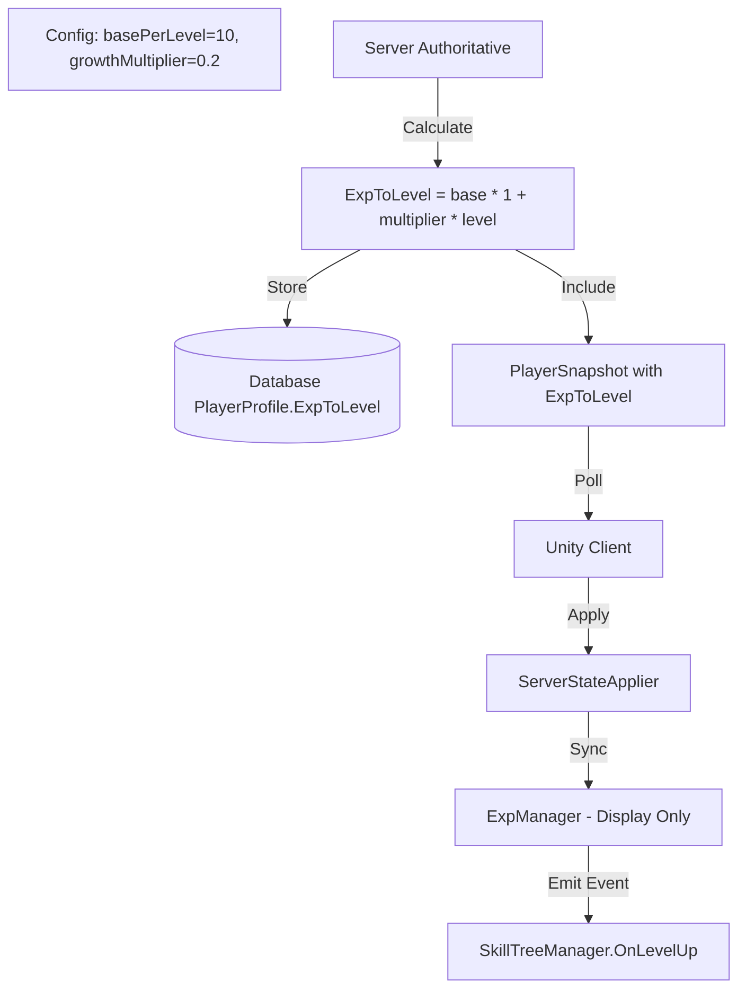

# Remove Exp Logic from Client and Add ExpToLevel with Growth Multiplier

## Overview

Remove all exp calculation logic from client-side `ExpManager` and make server fully authoritative for exp/level progression. Fix exp curve calculation formula to use `basePerLevel * (1 + growthMultiplier * currentLevel)`, add `growthMultiplier` field to config, change `basePerLevel` from 100 to 10, and add `ExpToLevel` field to database, server models, and sync it to client for UI display. Keep `ExpManager` component but only for displaying server data and emitting `OnLevelUp` event.

## Current State Issues

**Exp Curve Logic (WRONG):**

- Current server logic: `BasePerLevel * level` (linear multiplier)
- Should be: `BasePerLevel * (1 + GrowthMultiplier * currentLevel)`
- Example: Level 0→1: 10 exp, Level 1→2: 12 exp (10 + 20%), Level 2→3: 14 exp (10 + 40%)

**Config:**

- `basePerLevel` = 100 (should be 10)
- Missing `growthMultiplier` field (should be 0.2 for 20% increase per level)

**Client (ExpManager.cs):**

- Calculates `expToLevel` using `GetExpForNextLevel()` method (should be removed)
- Handles `OnEnemyDefeated` event and reports kills to server (should be removed)
- Has `expGrowthMultiplier = 1.2f` field but not used correctly (should be in config)

**Server:**

- `PlayerProfile` entity: Level, Exp, Gold (no ExpToLevel)
- `PlayerState`: Level, Exp, Gold (no ExpToLevel)
- `PlayerSnapshot` DTO: Level, Exp, Gold (no ExpToLevel)
- `GameConfigService.GetExpForNextLevel()` uses wrong formula

**References:**

1. `ServerStateApplier.cs`: Calls `expManager.SyncFromServer(snapshot.level, snapshot.exp)`
2. `SkillTreeManager.cs`: Subscribes to `ExpManager.OnLevelUp` event

## Implementation Plan

### 1. Config Changes

**File**: `shared/game-config.json`

- Change `expCurve.basePerLevel` from 100 to 10
- Add `growthMultiplier: 0.2` to `expCurve` object

**File**: `server/Services/GameConfigService.cs`

- Update `ExpCurve` class to add `GrowthMultiplier` property (float, default 0.2)
- Fix `GetExpForNextLevel()` method:
- Old: `return curve.BasePerLevel * level;`
- New: `return (int)(curve.BasePerLevel * (1 + curve.GrowthMultiplier * currentLevel));`
- Handle level 0: `return curve.BasePerLevel;` (no multiplier)

**File**: `game/Assets/Scripts/Config/GameConfigLoader.cs`

- Update `ExpCurveData` class to add `growthMultiplier` field (float, default 0.2f)
- Remove unused logic (server is authoritative)

### 2. Database Changes

**File**: `server/Models/Entities/PlayerProfile.cs`

- Add `ExpToLevel` property (int)
- Initialize from config when creating new player

**File**: `server/Services/PlayerService.cs`

- Update `FindOrCreatePlayerAsync()` to calculate and set `ExpToLevel` from config when creating new player
- Update `SavePlayerProgressAsync()` to save `ExpToLevel`

### 3. Server State Model

**File**: `server/Models/States/PlayerState.cs`

- Add `ExpToLevel` property (int)
- Update `RegisterOrLoadPlayer()` in `WorldService.cs` to calculate and set `ExpToLevel` when creating PlayerState

### 4. Server DTO

**File**: `server/Models/Dto/SnapshotDto.cs`

- Add `ExpToLevel` parameter to `PlayerSnapshot` record
- Update `WorldService.GetStateSnapshot()` to include `ExpToLevel` in snapshot

### 5. Server Logic

**File**: `server/Services/WorldService.cs`

- Update `AwardKillRewards()` to recalculate and update `ExpToLevel` after level changes using `_config.GetExpForNextLevel()`
- Update `RegisterOrLoadPlayer()` to calculate and set `ExpToLevel` from config
- Update `GetStateSnapshot()` to include `ExpToLevel` in PlayerSnapshot
- Update `CreateDefaultPlayer()` to calculate and set `ExpToLevel` from config

**File**: `server/Services/GameConfigService.cs`

- Update `GetExpForNextLevel()` with correct formula (see Config Changes above)

### 6. Client DTO

**File**: `game/Assets/Scripts/Net/NetClient.cs`

- Update `PlayerSnapshot` class (in DTOs region) to add `expToLevel` field

### 7. Client State Applier

**File**: `game/Assets/Scripts/Net/ServerStateApplier.cs`

- Update `ApplySnapshot()` to pass `expToLevel` to `expManager.SyncFromServer()`
- Change from: `expManager.SyncFromServer(snapshot.level, snapshot.exp)`
- To: `expManager.SyncFromServer(snapshot.level, snapshot.exp, snapshot.expToLevel)`

### 8. Client ExpManager (Simplify)

**File**: `game/Assets/Scripts/PlayerScripts/ExpManager.cs`**Remove:**

- `GetExpForNextLevel()` method (no longer calculate on client)
- `OnEnemyDefeated` event handler and `OnEnemyDefeated()` method
- `OnEnable()` and `OnDisable()` subscriptions to `Enemy_Health.OnMonsterDefeated`
- `ApplyDefaults()` method (or simplify to only set UI fields)
- `expGrowthMultiplier` field (moved to config, server authoritative)

**Keep:**

- `OnLevelUp` event (used by `SkillTreeManager`)
- `SyncFromServer()` method (update signature to accept `expToLevel`)
- `UpdateUI()` method
- Public fields: `level`, `currentExp`, `expToLevel`, `expSlider`, `currentLevelText`

**Update:**

- `SyncFromServer(int newLevel, int newExp, int newExpToLevel)`:
- Set `level`, `currentExp`, `expToLevel` directly from parameters
- Fire `OnLevelUp` event if level increased
- Call `UpdateUI()`
- `Start()`: Remove `ApplyDefaults()` call, just call `UpdateUI()`

### 9. Validation

**Check SkillTreeManager:**

- Verify `SkillTreeManager.cs` still works with `ExpManager.OnLevelUp` event
- Event signature remains the same: `Action<int>` (levels gained)
- No changes needed to `SkillTreeManager.cs`

## Exp Curve Formula

```javascript
expToLevel = basePerLevel * (1 + growthMultiplier * currentLevel)

Examples with basePerLevel=10, growthMultiplier=0.2:
- Level 0 → 1: 10 * (1 + 0.2 * 0) = 10 exp
- Level 1 → 2: 10 * (1 + 0.2 * 1) = 12 exp
- Level 2 → 3: 10 * (1 + 0.2 * 2) = 14 exp
- Level 3 → 4: 10 * (1 + 0.2 * 3) = 16 exp
```


## Data Flow




## Migration Notes

- Existing players: `ExpToLevel` will be recalculated on next state sync or kill reward
- Config change: `basePerLevel` 100 → 10, add `growthMultiplier: 0.2`
- Server logic fix: Update exp calculation formula
- No breaking changes to existing functionality
- `SkillTreeManager` continues to work with `OnLevelUp` event

## Testing

1. Verify exp bar displays correctly with server-calculated `expToLevel`